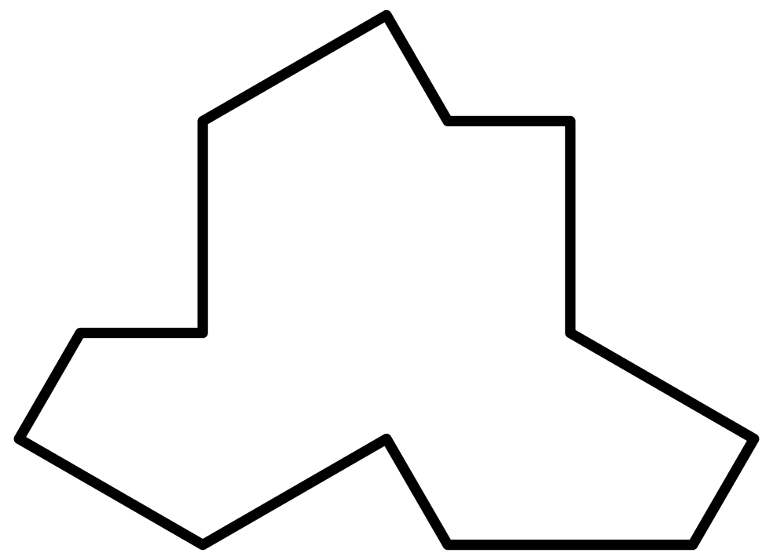
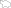
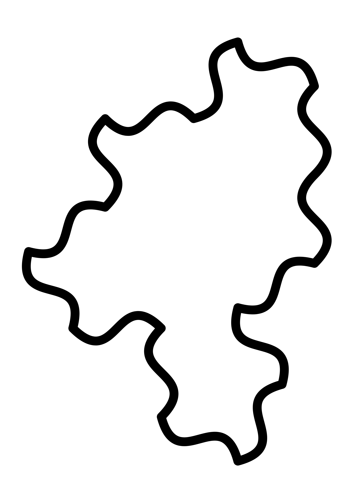

# The aperiodic monotile in a variety of formats

This repository contains code and vector image files to produce [the aperiodic monotiles found by David Smith, Joseph Samuel Myers, Craig S. Kaplan, and Chaim Goodman-Strauss](https://cs.uwaterloo.ca/~csk/hat/).

There's a family of related shapes, each made of 14 edges (though two of the edges are parallel and adjacent so look like a single long edge).
Each edge is one of two lengths, 𝑎 or 𝑏. The angles in the shape don't change.
There is [an interactive tool](https://somethingorotherwhatever.com/aperiodic-monotile/interactive.html) to draw the tiles with any choice of the parameters and download in SVG or PNG format.

There are three interesting monotiles, which each tile the plane aperiodically.

A 'hat':

A 'turtle':

And a 'spectre':

Each file produces a single copy of the tile. Several copies of the tile fit together to tile the plane:

* The 'hat' monotile can tile the plane together with its reflection.
* The 'turtle' monotile can also tile the plane with its reflection. (It and the hat are two of a family of polygons that tile the plane in the same way.)
* The 'spectre' monotile, with curved edges, can tile the plane _only_ without its reflection. (The spectre with straight edges is related to both the hat and turtle, but it can tile the plane periodically _and_ aperiodically. An aperiodic tiling can be forced by forbidding reflections—which is effectively what curving the edges accomplishes.)

The files are:

## Hat tile

* [hat-monotile.svg](hat-monotile.svg) - A vector graphics file for use in programs such as Inkscape or Adobe Illustrator.
* [hat-monotile-kites.svg](hat-monotile-kites.svg) - A vector graphics file showing the construction of each tile from kites.
* [hat-monotile.scad](hat-monotile.scad) - Code to produce the tile in [OpenSCAD](https://openscad.org/), for 3D printing.
* [hat-monotile.stl](hat-monotile.stl) - An STL file produced using the OpenSCAD code, which can be sent directly to a 3D printer, or manipulated in other 3D software.
* [hat-monotile.logo](hat-monotile.logo) - A LOGO script to draw the outline of the title with Turtle graphics.
* [hat-monotile.dxf](hat-monotile.dxf) - A DXF vector file, used by some CAD tools. *Created by Adam Greenblatt*.

## Turtle tile
* [turtle-monotile.svg](turtle-monotile.svg) - A vector graphics file for use in programs such as Inkscape or Adobe Illustrator.
* [turtle-monotile-kites.svg](turtle-monotile-kites.svg) - A vector graphics file showing the construction of each tile from kites.
* [turtle-monotile.scad](turtle-monotile.scad) - Code to produce the tile in [OpenSCAD](https://openscad.org/), for 3D printing.
* [turtle-monotile.stl](turtle-monotile.stl) - An STL file produced using the OpenSCAD code, which can be sent directly to a 3D printer, or manipulated in other 3D software.
* [turtle-monotile.logo](turtle-monotile.logo) - A LOGO script to draw the outline of the title with Turtle graphics.
* [turtle-monotile.dxf](turtle-monotile.dxf) - A DXF vector file, used by some CAD tools. *Created by Adam Greenblatt*.

## Spectre tile
* [spectre-monotile.svg](spectre-monotile.svg) - A vector graphics file for use in programs such as Inkscape or Adobe Illustrator.
* [spectre-monotile.scad](spectre-monotile.scad) - Code to produce the tile in [OpenSCAD](https://openscad.org/), for 3D printing.
* [spectre-monotile.stl](spectre-monotile.stl) - An STL file produced using the OpenSCAD code, which can be sent directly to a 3D printer, or manipulated in other 3D software.
* [spectre-monotile-outline.scad](spectre-monotile-outline.scad) - OpenSCAD to produce an outline of the tile.
* [spectre-monotile-outline.stl](spectre-monotile-outline.stl) - An STL file of the outline.
* [spectre-monotile-this-way-up.scad](spectre-monotile-this-way-up.scad) - OpenSCAD to produce the tile with raised text "This way up" on one side.
* [spectre-monotile-this-way-up.stl](spectre-monotile-this-way-up.stl) - An STL file of the above.
* [spectre-monotile-250ct-34x18.svg](spectre-monotile-250ct-34x18.svg) - A vector graphics file for laser cutting 250 tiles on a 34"x18" surface. *Created by Mahrud Sayrafi*.
